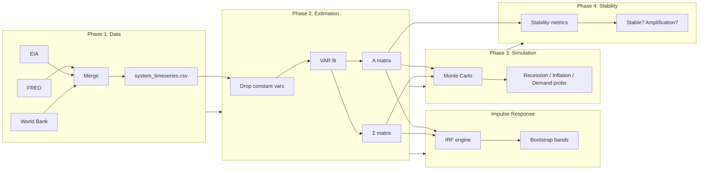

# Energy–Macro Shock Propagation Simulator — Detailed Documentation

A **stochastic systems model** that links energy markets to macroeconomic variables, estimates a **Vector Autoregression (VAR)** from real data, runs **Monte Carlo simulations**, computes **impulse responses** with optional bootstrap bands, and reports **stability and risk metrics**. The project includes both a **Python pipeline** and an **R pipeline**, plus a **Shiny dashboard** for interactive exploration. This document explains what the project does, what happens at every step, and how to interpret the results.

---

## What the Project Does (High-Level)

The simulator answers questions like:

- **How do oil price shocks propagate** into inflation, interest rates, industrial output, and GDP?
- **How stable** is the estimated energy–macro system? (Do small shocks die out or explode?)
- **What is the probability of recession**, high inflation, or demand stress over a given horizon under random shocks?
- **What is the impulse response** of each variable to a one-time structural shock, and how uncertain is it?

It does this by:

1. **Ingesting** macroeconomic data (FRED), electricity demand data (EIA), and structural indicators (World Bank).
2. **Building a single monthly time series** of transformed variables (oil returns, inflation change, rate change, industrial return, GDP growth, demand change, renewable share).
3. **Estimating a VAR** so that the system evolves as **X(t+1) = A·X(t) + ε**, with **ε ~ N(0, Σ)**. Variables with zero (or near-zero) variance are dropped before VAR so the covariance matrix is non-singular.
4. **Computing impulse responses** using **structural shocks** (Cholesky of Σ), with optional **bootstrap confidence bands** (500 replications).
5. **Simulating** many future paths with random shocks and computing **recession probability**, **inflation stress**, and **demand stress**. System dimension **K** is taken from the estimated A (adaptive to dropped variables).
6. **Checking stability** (eigenvalues of **A**, spectral radius) and **shock amplification**.

---

## Mindmap: Project Structure and Flow

```mermaid
mindmap
  root((Energy–Macro Shock Propagation Simulator))
    Data Ingestion
      FRED
        DCOILWTICO oil
        CPIAUCSL inflation
        FEDFUNDS rates
        INDPRO industry
        UNRATE unemployment
        GDPC1 GDP
      EIA
        Retail electricity sales
        Demand proxy
        Renewable share
      World Bank
        Energy import dependency
        Energy intensity
    Data Cleaning
      Merge FRED + EIA
      Build transforms
        oil_return
        inflation_change
        rate_change
        industrial_return
        gdp_growth
        demand_change
        renewable_share
      system_timeseries.csv
    Parameter Estimation
      Drop constant variables sd < 1e-8
      Moments μ Σ on retained vars
      VAR fit
        A matrix K×K
        Covariance Σ
      Eigenvalues
      Spectral radius
    Impulse Response
      Structural shock Cholesky Σ
      IRF h = 0 … horizon
      Bootstrap 500× → 5th, 95th
      Peak, time to peak, half-life, cumulative
    Monte Carlo
      X(t+1) = A X(t) + ε
      K = nrow(A)
      Recession prob
      Inflation stress
      Demand stress
    Stability Metrics
      Eigenvalues
      Stable vs unstable
      Shock amplification
      Sensitivity ranking
    Shiny Dashboard
      Overview, FRED, EIA, World Bank
      System series, Model A & Σ
      Stability, Monte Carlo, IRF
      Summary table in sidebar
      Data from 2000 onward
```

---

## Pipeline Flow (Step-by-Step)



---

## Phase 1: Data Ingestion

### 1.1 FRED (Federal Reserve Economic Data)

**What it does:** Fetches six US series from the FRED API:

| Series ID   | Meaning                          | Role in model                    |
|------------|-----------------------------------|----------------------------------|
| DCOILWTICO | WTI crude oil price ($/barrel)   | → **oil_return** (log return)    |
| CPIAUCSL   | Consumer price index (CPI-U)      | → **inflation_change** (% chg)   |
| FEDFUNDS   | Federal funds rate               | → **rate_change** (first diff)   |
| INDPRO     | Industrial production index      | → **industrial_return** (log)   |
| UNRATE     | Unemployment rate                | (available; not in VAR in default) |
| GDPC1      | Real GDP (chained, quarterly)    | → **gdp_growth** (% chg)         |

GDP is quarterly; the code converts it to monthly by forward-filling so it can be merged with monthly EIA data. Output: `data/fred_raw.csv`.

---

### 1.2 EIA (US Energy Information Administration)

**What it does:** Fetches US retail electricity sales (all sectors, monthly) as a **demand proxy**, plus renewable share of generation when available. Writes `data/eia_raw.csv`.

---

### 1.3 World Bank

**What it does:** Fetches structural indicators for the USA (no API key): energy import dependency, energy intensity. Writes `data/worldbank_structural.csv`. Used for structural context; the main VAR uses the merged FRED + EIA series.

---

### 1.4 Data Cleaning (Merge + Transforms)

**What it does:**

- Merges FRED and EIA on **date** (only dates present in both).
- Builds the series that go into the VAR:
  - **oil_return** = log return of DCOILWTICO
  - **inflation_change** = % change in CPIAUCSL
  - **rate_change** = first difference of FEDFUNDS
  - **industrial_return** = log return of INDPRO
  - **gdp_growth** = % change in GDPC1
  - **demand_change** = log return of retail_sales (or demand_growth_rate)
  - **renewable_share** = share of renewable generation (0–1), filled/zeroed if missing
- Drops rows with any missing in the core columns, requires **> 100 rows**, then writes **system_timeseries.csv**.

---

## Phase 2: Parameter Estimation (R)

The **R pipeline** (`R/05_parameter_estimation.R`) is used when running the full R flow or when the Shiny app triggers a refresh; the **Python pipeline** can also be used. The following describes the **R** behaviour.

### 2.1 Constant-variable removal

**What it does:** Before fitting the VAR, the code:

- Computes the **standard deviation** of each variable in `system_timeseries.csv`.
- **Drops** any variable with **sd < 1e-8** (treats them as constant to avoid a singular covariance matrix).
- Prints which variables were **removed** and which are **retained** for the VAR.
- If **fewer than 3 variables** remain, it **stops** with: *"Insufficient non-constant variables for VAR estimation."*
- Saves **A** and **Σ** with row/column names equal to the **retained** variable names (so the dashboard and Monte Carlo use the same dimension **K**).

This makes estimation **robust** when, for example, `renewable_share` (or another series) has zero variance in the sample.

### 2.2 Moments and VAR fit

**What it does:** On the **retained** variables only:

- Computes **μ**, **Σ**, and correlation.
- Fits a VAR with lag order chosen by **AIC** (e.g. up to lag 8).
- Extracts the **first-lag coefficient matrix A** (K×K) and the **residual covariance Σ**.
- Ensures **Σ** is symmetric and, if needed, projects to a positive-definite matrix (e.g. `Matrix::nearPD`).
- Writes **A_matrix.csv** and **covariance_matrix.csv** (with row/column names).
- Prints eigenvalues and **spectral radius ρ(A)**. If **ρ(A) < 1**, the system is **stable**.

---

## Impulse Response (IRF)

The **R** module `R/irf_engine.R` computes **structural** impulse responses and optional **bootstrap** bands.

### 3.1 Structural shocks

- **Cholesky:** **Σ = P P′** (lower triangular **P**). One unit of the *j*-th structural shock corresponds to the impulse vector **P[, j]**.
- **Shock size:** The user can scale by a multiplier (e.g. “1 SD” = one standard deviation of the structural shock). The IRF is **x(0) = shock**, **x(h) = A·x(h−1)** for h = 1, …, horizon.
- **Output:** Full IRF matrix (horizon+1 × K) and, in the dashboard, **peak response**, **time to peak**, **half-life**, and **cumulative impact** for the shocked variable.

### 3.2 Bootstrap confidence bands

- **Residuals** from the fitted VAR are **resampled** with replacement.
- **Synthetic data** are generated using the fitted dynamics; the VAR is **re-estimated** on each synthetic sample.
- **IRF** is recomputed for each replication (500 by default).
- **Median**, **5th**, and **95th** percentiles are returned. The dashboard can show **90% bootstrap bands** (5th–95th) around the main IRF when “Show confidence bands” is checked (after “Compute bootstrap bands (500)” has been run).

---

## Phase 4: Monte Carlo (R)

The **R** engine (`R/06_monte_carlo_engine.R`):

- Takes **A** and **Σ** from the estimation step (possibly **K < 7** if some variables were dropped).
- **System dimension K = nrow(A)** (no fixed list length). Variable names come from **rownames(A)**.
- Simulates **X(t+1) = A·X(t) + ε(t)** for the chosen horizon and number of paths. **ε** are drawn from **N(0, Σ)**.
- **Recession probability** = share of paths with **gdp_growth < 0** at the end horizon (or at any month). **Inflation stress** = share of path-months with inflation change > 4%. **Demand stress** = share of path-months with demand change below a threshold. If a variable was dropped (e.g. gdp_growth), the corresponding metric is **NA**.
- **Shock helpers** `oil_shock()` and `demand_shock()` build a length-K vector; they use the **actual variable names** from the system so they remain correct when variables are dropped.

---

## Phase 5: Stability Metrics

- Reads **A_matrix.csv**, computes **eigenvalues** and **spectral radius ρ(A)**.
- **ρ(A) < 1** → system is **stable** (shocks die out in expectation).
- **Shock amplification factor** (e.g. Frobenius norm of A) summarizes one-step amplification. **Sensitivity ranking** (row/column sums of |A|) shows which variables are most driven by or drive others.

---

## Shiny Dashboard

The **Shiny app** (`app.R`) provides an interactive dashboard. Run it from the `energy_macro_system` directory (see **How to Run** below).

### Layout

- **Sidebar (width 3):** “Refresh data” button, data directory note, data status, and the **System series summary** table (Variable, Mean, SD, Min, Max). The summary table is a **DataTable** with horizontal scroll so **Min** and **Max** are visible; it is always visible on every tab.
- **Main panel (width 9):** Tabbed content with **larger plot heights** so graphs fill the page.

### Tabs and behaviour

| Tab | Content |
|-----|--------|
| **Overview** | FRED series (levels) and system series (returns/changes) from **2000 onward**. FRED series links to https://fred.stlouisfed.org/series/{ID}. |
| **FRED** | Single-series selector; plot and table from **2000 onward**. “View {series} on FRED” link; table preceded by links for each series code. |
| **EIA** | Retail sales and renewable share plots; data table. |
| **World Bank** | Structural indicators from **2000 onward**; plot and table. |
| **System series** | Select one variable; plot with **Y-axis label** describing the metric (e.g. “Log return (oil price)”, “GDP growth (%)”, “Renewable share (0–1)”). Data table. |
| **Model (A & Σ)** | Transition matrix **A** and residual covariance **Σ** (from the retained variables). |
| **Stability** | Spectral radius, stability message, eigenvalue plot. |
| **Monte Carlo** | Horizon, number of simulations, “Run MC” button; recession prob, inflation stress; mean GDP path plot. |
| **Impulse Response** | Shock variable, **shock size (SD units)**, horizon slider, **“Show confidence bands”** checkbox, “Compute bootstrap bands (500)” button. **Value boxes:** Peak response, Time to peak, Half-life, Cumulative impact. Main IRF plot with optional 90% bootstrap bands. Collapsible **“Interpretation guide”** (structural shock, how to read IRF, stability, confidence bands). |

### Data and UX details

- **FRED and World Bank** plots and tables show only data from **year 2000 onward**.
- **FRED series codes** (e.g. CPIAUCSL) are hyperlinked to `https://fred.stlouisfed.org/series/{ID}` in the FRED tab and on the Overview tab.
- **Collapsible “About This Section”** (and, on IRF, “Interpretation guide”) panels on each tab explain what the data represents and how to interpret metrics.
- **System series summary** in the sidebar uses the same Variable/Mean/SD/Min/Max definitions; the metric note explains Mean → long-run average, SD → volatility, Min/Max → extremes.

### Startup

- If **system_timeseries.csv** does not exist, the app can run the **R pipeline** once (e.g. `R/run_all.R`) to ingest data and estimate parameters; otherwise it loads from **data/** (cached). “Refresh data” reloads from disk.

---

## System Series: What the Numbers Represent

The dashboard labels the **Y-axis** (or facet) for each system variable so the units are clear:

| Variable | Y-axis / metric meaning |
|----------|--------------------------|
| oil_return | Log return (oil price) |
| inflation_change | Inflation % change (CPI) |
| rate_change | Rate change (pp, Fed funds) |
| industrial_return | Log return (industrial production) |
| gdp_growth | GDP growth (%) |
| demand_change | Demand % change (electricity) |
| renewable_share | Renewable share (0–1) |

---

## Project Structure (Reference)

```
energy_macro_system/
├── data/                         # Outputs (git-ignored except .gitkeep)
│   ├── fred_raw.csv
│   ├── eia_raw.csv
│   ├── worldbank_structural.csv
│   ├── system_timeseries.csv
│   ├── A_matrix.csv
│   └── covariance_matrix.csv
├── R/                            # R pipeline + IRF
│   ├── 01_fetch_fred.R
│   ├── 02_fetch_eia.R
│   ├── 03_fetch_worldbank.R
│   ├── 04_data_cleaning.R
│   ├── 05_parameter_estimation.R  # VAR, drop constant vars, A, Σ
│   ├── 06_monte_carlo_engine.R     # simulate_system(); K from A
│   ├── 07_stability_metrics.R
│   ├── irf_engine.R                # compute_irf(), bootstrap_irf()
│   └── run_all.R
├── python/                       # Python pipeline (optional)
│   ├── fetch_fred.py
│   ├── fetch_eia.py
│   ├── fetch_worldbank.py
│   ├── data_cleaning.py
│   ├── parameter_estimation.py
│   ├── monte_carlo_engine.py
│   └── stability_metrics.py
├── app.R                          # Shiny dashboard
├── run_all.py                     # Full Python pipeline
├── requirements.txt
├── .env                           # FRED_API_KEY, EIA_API_KEY (not committed)
├── README.md
└── README_DETAILED.md             # This file
```

---

## How to Run

### R pipeline (data + estimation + MC + stability)

From the project root (parent of `energy_macro_system`), or from `energy_macro_system`:

```bash
cd energy_macro_system
Rscript -e "source('R/run_all.R')"
```

Or from R:

```r
setwd("energy_macro_system")
source("R/run_all.R")
```

This runs 01 → 02 → 03 → 04 → 05 (with constant-variable removal and VAR), then 06 (Monte Carlo) and 07 (stability). It expects `data/` to exist and will write CSVs there.

### Shiny dashboard

From R (with working directory set to `energy_macro_system`):

```r
setwd("energy_macro_system")
shiny::runApp(".")
```

Or from the shell:

```bash
cd energy_macro_system
Rscript -e "shiny::runApp('.')"
```

If `data/system_timeseries.csv` is missing, the app may run the R pipeline once on startup to populate data; otherwise it uses cached CSVs. Use “Refresh data” to reload from disk after re-running the pipeline.

### Python pipeline (optional)

```bash
cd energy_macro_system
pip install -r requirements.txt
# Set FRED_API_KEY and EIA_API_KEY in .env
python run_all.py
```

---

## Short Summary Table

| Step | Input | Output | Leads to |
|------|--------|--------|----------|
| 1a–c | FRED, EIA, World Bank | fred_raw, eia_raw, worldbank_structural | Merge |
| 1d | Merge + transforms | system_timeseries.csv (≥100 rows, 7 vars) | VAR input |
| 2 | system_timeseries | Drop constant vars → VAR → A, Σ (K×K) | Dynamics, stability, IRF, MC |
| IRF | A, Σ, shock_var, horizon | IRF matrix; optional bootstrap 5th/95th | Dashboard IRF tab |
| 3 | A, Σ; horizon, n_sim | Recession / inflation / demand probs (K from A) | Risk metrics |
| 4 | A | Stable? ρ(A); amplification; sensitivity | Stability tab |
| App | data/*.csv | Dashboard: plots from 2000, summary in sidebar, IRF with bands | Interactive use |

---

## Optional: Export README to DOCX

To get a **.docx** from this Markdown (e.g. for sharing):

- **Pandoc:** `pandoc README_DETAILED.md -o README_DETAILED.docx`
- Or open `README_DETAILED.md` in VS Code / Cursor and use “Markdown: Export to Word” (or similar) if you have an extension for it.

The mindmap and flowcharts are in **Mermaid**. They render in GitHub, GitLab, and many Markdown viewers; if you export to DOCX, you may need to paste screenshots of the rendered diagrams or use a tool that supports Mermaid in the export.
